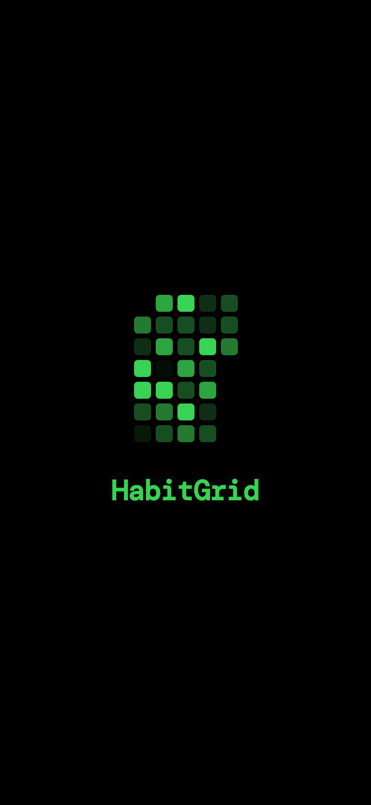
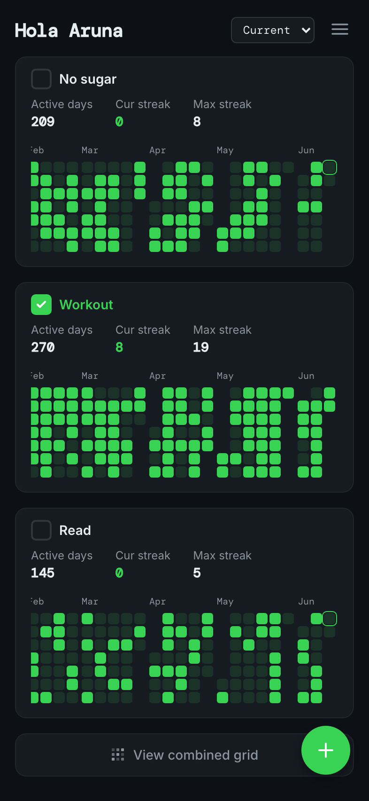
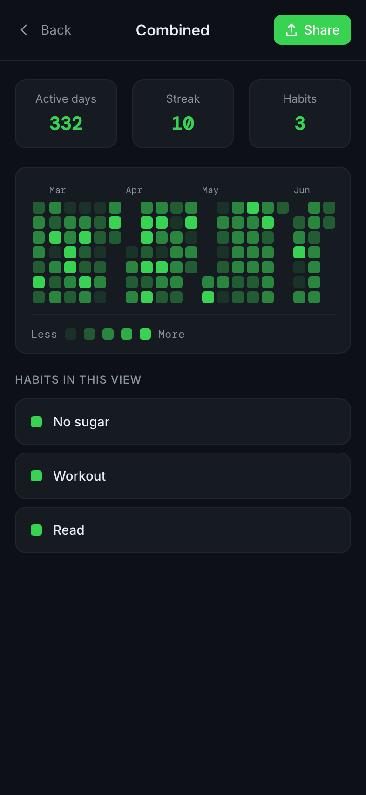
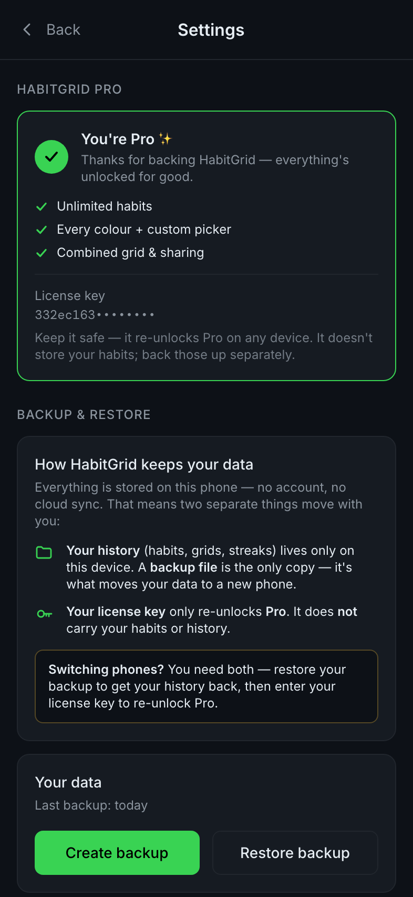
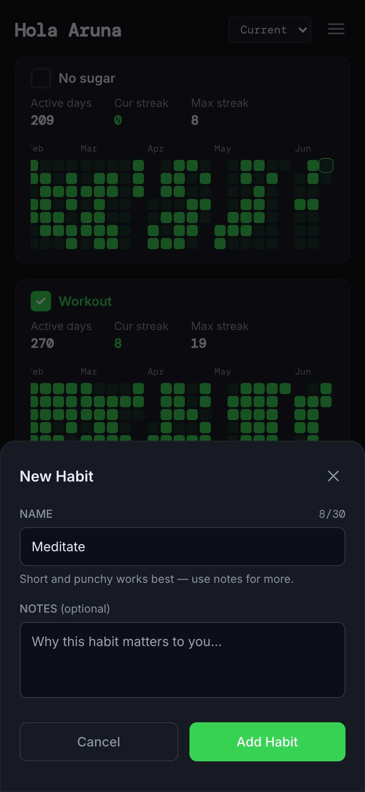
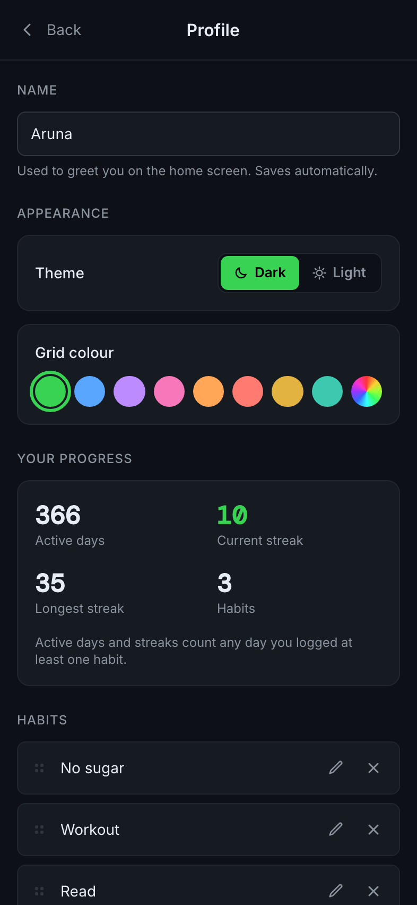

# HabitGrid

A GitHub/LeetCode-style habit tracker PWA. Build streaks, visualise consistency, and share your progress — all stored locally, no account needed.

🔗 **[habitgrid-steel.vercel.app](https://habitgrid-steel.vercel.app)**

<p align="center">
  
  
  
  
</p>

---

## Features

- **Contribution grids** — each habit gets its own month-block grid, GitHub/LeetCode-style
- **Light & dark themes** — toggle in Profile; the whole app and grids adapt instantly
- **Per-habit check-in** — tap the checkbox next to a habit name to log today; the cell fills instantly
- **Backdate yesterday** — missed logging last night? tap yesterday's cell (only yesterday — forgiving, not gameable)
- **Stats per habit** — active days, current streak, and max streak shown inline on every card
- **Year view** — a rolling 12-month "Current" view, or jump to a full calendar year (2025 onward; the current year stops at today)
- **Combined grid** — merge all habits into one intensity-shaded grid, darker = fewer done, brighter = all done (Pro)
- **Share as PNG** — exports a clean card image via the native share sheet; falls back to download on desktop
- **Custom accent colour** — default green is free; Pro unlocks 8 presets + a custom picker. The grid, UI, and splash all update instantly
- **Guided onboarding** — a welcome screen plus an interactive tour that walks new users through creating a habit and logging progress
- **Profile** — your name, theme, grid colour, a progress summary (active days, streaks), and habit management: rename, reorder, and delete (with confirmation)
- **Splash screen** — a flickering matrix of the current month's grid on every launch
- **Private notes** — attach a personal memo to each habit; stored locally, never shown publicly
- **Backup & restore** — export your data as a JSON file; restore on any device
- **Installable PWA** — add to home screen on iOS/Android/desktop; renders as a centered, phone-width app on larger screens

---

## Pro

HabitGrid is free for up to 3 habits. **HabitGrid Pro** ($4.99, one-time) unlocks:

- Unlimited habits
- Full colour palette + custom picker
- Combined grid view

HabitGrid is local-first, so Pro status and your data travel separately: a one-time **license key** re-unlocks Pro on any device, while a **backup file** carries your history. When you switch phones you need both — restore the backup, then re-enter the key.

---

## Screenshots

| Splash | Main grid | Add habit | Combined |
|--------|-----------|-----------|----------|
|  |  |  |  |

| Settings | Profile (theme, colour, progress, habits) |
|----------|-------------------------------------------|
|  |  |

---

## Tech stack

| Layer | Choice |
|-------|--------|
| Framework | React 18 + TypeScript |
| Build tool | Vite 4 |
| State / persistence | Zustand with `persist` middleware → localStorage |
| Styling | Tailwind CSS v3 + inline CSS variables for theming |
| PWA | `vite-plugin-pwa` + Workbox (cache-first, auto-update) |
| Share image | Canvas API drawn programmatically — no extra deps |
| Payments | Dodo Payments (one-time license key) |
| Hosting | Vercel |

---

## Local development

```bash
# Node 18+ required
git clone https://github.com/aruna09/habitgrid.git
cd habitgrid
npm install
npm run dev        # http://localhost:5173
```

### Build for production

```bash
npm run build      # output in dist/
npm run preview    # preview the built PWA locally
```

### Environment variables

| Variable | Description |
|---|---|
| `DODO_API_KEY` | Dodo Payments API key (server-side) |
| `VITE_DODO_CHECKOUT_URL` | Dodo checkout URL for Pro purchase |
| `DODO_TEST_MODE` | Set to `true` to use Dodo test environment |

---

## Data & privacy

Everything lives in your browser's `localStorage` under the key `habitgrid-storage` — no account, no cloud sync. The only data that ever leaves your device is your license key, sent once to verify your Pro purchase. Nothing else is sent to any server.

[Full privacy policy →](https://habitgrid-steel.vercel.app/privacy.html)

---

## Roadmap

### Shipped
- [x] GitHub-style contribution grids per habit
- [x] Combined intensity grid across all habits
- [x] Share progress as PNG
- [x] Light & dark themes
- [x] Custom accent colour theming
- [x] Backdate up to yesterday
- [x] Guided onboarding — welcome screen + interactive tour
- [x] Habit management — rename, reorder, delete (with confirmation)
- [x] Backup & restore (JSON export/import)
- [x] HabitGrid Pro — freemium with Dodo Payments

### Coming
- [ ] Streak notifications / reminders
- [ ] Friend codes — share a read-only view of your grid
- [ ] Widget (iOS 16+ WidgetKit via PWA)
- [ ] Cloud sync (optional, paid add-on)
